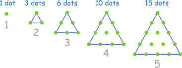

# Number Shapes?
This is a Simple app that tells whether the no. entered by the user is a Square No./ Triangular No. or both.

## Triangular Number - 
Triangle number counts objects arranged in an equilateral triangle. The nth triangular number is the number of dots in the triangular arrangement with n dots on a side, and is equal to the sum of the n natural numbers from 1 to n. 
Eg-0, 1, 3, 6, 10, 15, 21, 28, 36, 45, 55,etc

## Square Number -
Square number or perfect square is an integer that is the square of an integer; in other words, it is the product of some integer with itself. For example, 9 is a square number.

An Example of both is 36. So if it is both Square and Triangular No. It even tells that!!

#### To get the direct link of the apk, click the link down below-

https://github.com/wolfy222/Number-Shapes/blob/master/app/release/Number%20Shapes.apk
